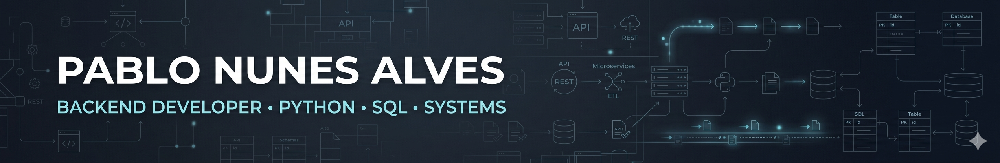

## Hi there 👋

<!--
**aquelepablo/aquelepablo** is a ✨ _special_ ✨ repository because its `README.md` (this file) appears on your GitHub profile.

Here are some ideas to get you started:

- 🔭 I’m currently working on ...
- 🌱 I’m currently learning ...
- 👯 I’m looking to collaborate on ...
- 🤔 I’m looking for help with ...
- 💬 Ask me about ...
- 📫 How to reach me: ...
- 😄 Pronouns: ...
- ⚡ Fun fact: ...
-->

  

  

    
<b>🇺🇸 English (Default) / 🇧🇷 Ler em Português</b>

    
Use the toggle bellow to open Portuguese section.

  

# Hi, I'm Pablo Nunes Alves 👋

  
  
  

Backend-focused developer with a strong background in systems analysis, SQL, business rules, and real-world delivery.

After many years working close to software from both the technical and business sides, I’m now sharpening my hands-on backend execution with a clear focus on **Python, APIs, data flows, and backend design**.

I’m especially interested in backend work that involves **clarity, traceability, validation, lifecycle control, and business-critical logic** — the kind of systems where understanding the real-world process matters as much as writing the code.

---

<b>🇧🇷 Português</b>

Sou um desenvolvedor com foco em backend, com base forte em análise de sistemas, SQL, regras de negócio e entrega em contexto real.

Depois de muitos anos atuando próximo ao software pelos lados técnico e negocial, hoje estou reforçando minha execução hands-on em backend, com foco claro em **Python, APIs, fluxos de dados e design de backend**.

Gosto especialmente de problemas que exigem **clareza, rastreabilidade, validação, controle de ciclo de vida e lógica de negócio** — sistemas em que entender o processo real importa tanto quanto escrever o código.

Hoje meu foco está em construir projetos que reflitam esse tipo de desafio de forma prática e honesta.

---

## 🚧 Current Focus

- Building stronger hands-on backend fluency with **Python** and **FastAPI**
- Designing APIs and backend flows with clear business intent
- Applying my long-term **SQL** and systems background to modern backend projects
- Creating portfolio projects that reflect **real-world constraints**, not tutorial-only code

---

## 📂 Featured Project

### 🚀 Regulatory Batch Processing System

**[regulatory-batch-processing](https://github.com/aquelepablo/regulatory-batch-processing)**

A backend portfolio project that demonstrates how to design an **auditable batch-processing workflow** using **Python, FastAPI, PostgreSQL, and SQL-first validation**.

This project focuses on:

- job-oriented batch processing
- explicit lifecycle transitions
- streaming ingestion
- raw data persistence for auditability
- SQL-first business validation
- separation between orchestration and validation logic

This is the kind of backend problem I enjoy most: systems that need structure, traceability, and business-rule clarity.

---

## 🛠️ Tech Stack

### Core

  
  
  
  
  
  

### Background Strengths

  
  
  
  
  

> I prefer to keep this profile conservative: only tools and concepts I actively use or can defend in a real conversation.

---

## 📊 GitHub Stats

  
  

---

## 📬 Connect

  

